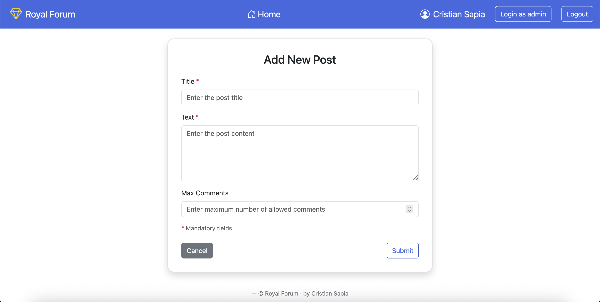
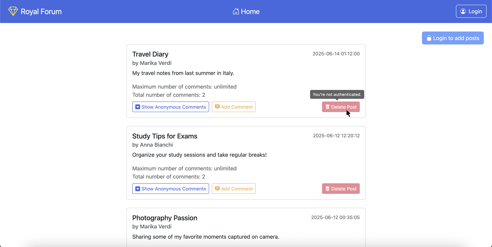
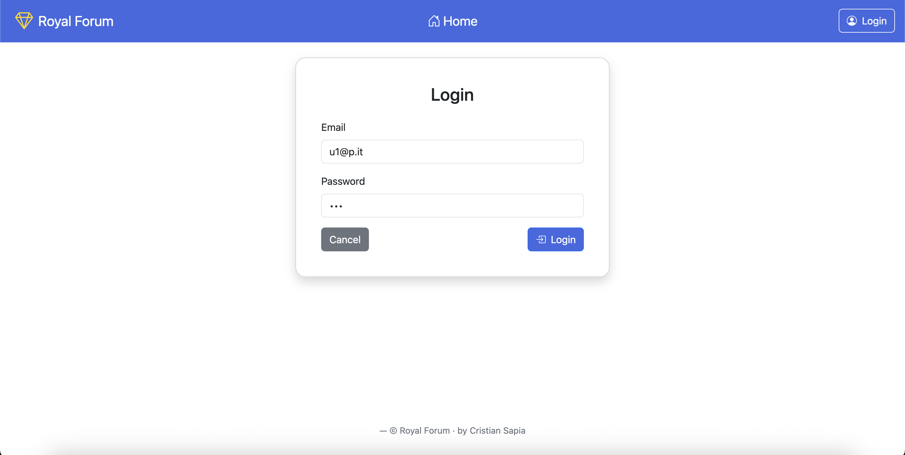

[](https://classroom.github.com/a/6EO6Vzam)
# Exam #1: "Forum"
## Student: s349451 SAPIA CRISTIAN

## React Client Application Routes

- Route `/`: display the homepage with all forum posts. Allows viewing and deleting posts, and expanding posts with associated comments.
- Route `/add-post`: form page to create a new post. It is accessible only to authenticated users.
- Route `/add-comment/:postId`: form page to add a comment to the post identified by postId.
- Route `/edit-comment/:id`: form page to edit the comment with the given id. It is only accessible to the comment’s author or any administrator.
- Route `/login`: login page for users and administrators. It supports standard login (e.g., username and password) and 2FA for admininistrators.
- Route `*`: page for nonexisting URLs (Not Found page) that redirects to the home page.

## API Server

- GET `/api/posts`: Retrieve the list of all the available posts in the forum.
  - **Response body**: JSON object with the list of posts, or with error description:
    ```json
    [ { "id": 1, "title": "Welcome to the Forum", "text": "First official post.", "userName": "Cristian",
      "userId": 1, "timestamp": "2025-06-08 15:24:50", "maxComments": 5, "commentCount": 5 }, ... ]
    ```
  - **Codes**: `200 OK`, `500 Internal Server Error`.

- POST `/api/posts`: Create a new post by providing all relevant information. Note that only autenticated users can perform this action.
  - **Request body**: JSON object with all relevant information:
    ```json
    { "title": "This is an amazing post!", "text": "This is a post of the Royal Forum", "maxComments": 10 }
    ```
  - **Response body**: JSON object with the newly added post, or with error description:
    ```json
    { "id": 1, "title": "This is an amazing post!", "text": "This is a post of the Royal Forum",
      "userName": "Cristian", "userId": 1, "timestamp": "2025-06-08 12:45:00", "maxComments": 10,
      "commentCount": 5 }
    ```
    An example of an error:
    ```json
    { "error": "Database error during post creation." }
    ```
  - **Codes**: `200 OK`, `401 Unauthorized`, `409 Conflict` (already existing title), `422 Unprocessable Entity`, `503 Service Unavailable`.

- DELETE `/api/posts/:id`: Delete an existing post, given its id. Note that only the post owner or an admin can perform this action.
  - **Response body**: JSON value with the number of changes in case of success, otherwise a JSON object with the error.
  - **Codes**: `200 OK`, `401 Unauthorized`, `403 Forbidden`, `404 Not Found`, `422 Unprocessable Entity`, `503 Service Unavailable`.

- GET `/api/posts/:id`: Retrieve an existing post given its id. Note that such an API is particularly useful to update the information about the number of comments associated with the post based on the information stored in the database. This is to maintain consistency when multiple users (from different clients) add comments at the same time.
  - **Response body**: JSON object with the information about the post, or with error description. Note that the response body content is similar to the `POST /api/posts` response.
  - **Codes**: `200 OK`, `404 Not Found`, `422 Unprocessable Entity`, `503 Service Unavailable`.

- GET `/api/posts/:id/comments`: Retrieve the list of all comments associated with a specific post, given its id. Note that anonymous users can retrieve only the anonymous comments for a given post.
  - **Response body**: JSON object with the list of comments, or with error description.

    An example of response body if the user is anonymous:
    ```json
    [ { "id": 11, "text": "Thanks for the guide.", "timestamp": "2025-06-09 12:20:31" }, ... ]
    ```
    An example of response body if the user is authenticated:
    ```json
    [ { "id": 11, "text": "Thanks for the guide.", "timestamp": "2025-06-09 12:20:31", "userId": 5,
        "userName": "Fabio Neri", "countInterestingMarks": 0, "isInterestingForCurrentUser": false }, ... ]
    ```
  - **Codes**: `200 OK`, `422 Unprocessable Entity`, `503 Service Unavailable`.

- POST `/api/posts/:id/comments`: Create a new comment related to a specific post, by providing all relevant information. Note that even anonymous users can create a comment.
  - **Request body**: JSON object with the text of the comment:
    ```json
    { "text": "This is my favorite post!" }
    ```
  - **Response body**: JSON object with the newly added comment, or with error description.

    An example of response body if the user is anonymous:
    ```json
    { "id": 25, "text": "This is my favorite post!", "timestamp": "2025-06-08 11:42:50", "postId": 3 }
    ```
    An example of response body if the user is authenticated:
    ```json
    { "id": 25, "text": "This is my favorite post!", "timestamp": "2025-06-08 11:42:50", "postId": 3,
      "userName": "Fabio Neri", "userId": 5, "countInterestingMarks": 0, "isInterestingForCurrentUser": false }
    ```
    An example of an error:
    ```json
    { "error": "Database error while adding comment." }
    ```
  - **Codes**: `200 OK`, `404 Not Found`, `409 Conflict` (comment limit reached), `422 Unprocessable Entity`, `500 Internal Server Error`.

- GET `/api/comments/:id`: Retrieve an existing comment given its id. Note that such an API is needed to pre-fill the "text" field when editing a comment.
  - **Response body**: JSON object with information about the comment, or with error description. Note that the response body content is similar to the previous case.
    
    An example of an error:
    ```json
    { "error": "Database error while retrieving the single comment." }
    ```
  - **Codes**: `200 OK`, `404 Not Found`, `422 Unprocessable Entity`, `503 Service Unavailable`.

- PUT `/api/comments/:id`: Update an existing comment (given its id) by providing the new text. Note that only the comment owner or an admin can perform this action.
  - **Request body**: JSON object with the new text of the comment:
    ```json
    { "text": "This is an updated comment!" }
    ```
  - **Response body**: JSON object with the updated comment information, or with error description (the response is similar to the `GET /api/comments/:id` response).
  - **Codes**: `200 OK`, `401 Unauthorized`, `403 Forbidden`, `404 Not Found`, `422 Unprocessable Entity`, `503 Service Unavailable`.

- DELETE `/api/comments/:id`: Delete an existing comment given its id. Note that only the comment owner or an admin can perform this action.
  - **Response body**: JSON value with the number of changes in case of success, otherwise a JSON object with the error.
  - **Codes**: `200 OK`, `401 Unauthorized`, `403 Forbidden`, `404 Not Found`, `422 Unprocessable Entity`, `503 Service Unavailable`.

- PUT `/api/comments/:id/interesting`: Add / remove the interesting mark for an existing comment, given its id. Note that only autenticated users can perform this action.
  - **Request body**: JSON object containing the `interesting` field set to `true` or `false` to mark or unmark the comment.
    ```json
    { "interesting": true }
    ```
  - **Response body**: JSON value with the number of changes in case of success, otherwise a JSON object with the error.
  - **Codes**: `200 OK`, `400 Bad Request` (e.g., DB constraint violation), `401 Unauthorized`, `404 Not Found`, `422 Unprocessable Entity`, `503 Service Unavailable`.

### Authentication APIs

- POST `/api/sessions`: Authenticate the user. Note that this API is used for login.
  - **Request body**: JSON object with username (email of the user) and password:
    ```json
    { "username": "u1@p.it", "password": "pwd" }
    ```
  - **Response body**: JSON object with user information, or with error description:
    ```json
    { "id": 1, "username": "u1@p.it", "name": "Cristian", "canDoTotp": true, "isTotp": false }
    ```
  - **Codes**: `200 OK`, `401 Unauthorized` (incorrect username and/or password).

- POST `/api/login-totp`: Perform 2FA (2 Factor Authentication) using TOTP.
  - **Request body**: JSON object with the TOTP code:
    ```json
    { "code": 123456 }
    ```
  - **Response body**: JSON object indicating success or failure (e.g., due to invalid TOTP code).
  
    An example of success:
    ```json
    { "otp": "authorized" }
    ```
  - **Codes**: `200 OK`, `401 Unauthorized` (invalid TOTP code).

- GET `/api/sessions/current`: Check whether the user is currently authenticated and retrieve the associated information.
  - **Response body**: JSON object with user information, or with error description.

    An example of response body if the user is authenticated:
    ```json
    { "id": 1, "username": "u1@p.it", "name": "Cristian", "canDoTotp": true, "isTotp": false }
    ```
    An example of response body if the user is anonymous:
    ```json
    { "error": "Not authenticated." }
    ```
  - **Codes**: `200 OK`, `401 Unauthorized`.

- DELETE `/api/sessions/current`: Logout the user by terminating the session.
  - **Response body**: An empty JSON object.
  - **Codes**: `200 OK`.


## Database Tables

- Table `USER`: id (primary key - autoincremented), email, name (i.e. full name), hash, salt, secret.
  - NOTE: the `secret` column is set only for administrators, for other users it is set to `NULL`.
- Table `POST`: id (primary key - autoincremented), title, user_ID, text, max_comments, timestamp
  - NOTE: it is a 1:N relationship, since a user can publish many posts, and a specific post is published by one specific user (i.e., the author).
- Table `COMMENT`: id (primary key - autoincremented), text, timestamp, user_ID, post_ID
  - NOTE: it is a 1:N relationship, since a user can publish many comments, and a specific comment is published by one specific user (i.e., the author).
- Table `INTERESTING`: user_ID, comment_ID (composite primary key)
  - This table keeps track of which users have marked which comments as interesting.
  - NOTE: it is a N:N relationship (that is why an additional table is necessary), since a user can mark as interesting many comments, and a comment can be marked as interesting by many users at the same time.

## Main React Components

- `App` (in `App.jsx`): Main component of the app, manages the states of the post list and the authenticated user (if any) and defines the main routes. It handles most of the API interactions and defines two critical useEffect hooks that handle fetching posts and managing user authentication state.

- `PostForm` (in `PostForm.jsx`): Form to create a new post. Handles input validation and calls the `createPost` function passed via props.

- `PostCard` (in `PostCard.jsx`): Displays a single post with title, text, author, timestamp, and comment info. Allows toggling comments visibility, adding new comments (if limit not reached), and deleting the post (if authorized).

- `CommentsCollapse` (in `PostCard.jsx`): Manages the collapsible display of a post’s comments. Supports marking comments as interesting, editing, and deleting comments, with user permission checks.

- `NotFoundLayout` (in `Layout.jsx`): Displays a message for invalid routes with a button to go back to the homepage.

- `LoginLayout` (in `Layout.jsx`): Shows the login form if the user is not authenticated. If the user requires 2FA, shows the TOTP form (`TotpLayout`) or redirects authenticated users that cannot perform 2FA to the homepage.

- `GenericLayout` (in `Layout.jsx`): Main app layout including the navbar, dynamic content area (`Outlet`), and footer.

- `BodyLayout` (in `Layout.jsx`): Displays a list of posts or a loading spinner (`SpinnerLoadingLayout`) if posts are not yet loaded. Includes a button to add a post (disabled if user is not logged in) and shows alerts for messages.

- `AddPostLayout` (in `Layout.jsx`): Layout for adding a new post with a centered post creation form.

- `AddCommentLayout` (in `Layout.jsx`): Layout to add a comment to a specific post, retrieving the post ID from the URL.

- `EditCommentLayout` (in `Layout.jsx`): Layout to edit an existing comment: loads comment data by comment id, shows a loading spinner while fetching, and handles errors by showing a message.

- `CustomNavbar` (in `CustomNavbar.jsx`): A top navigation bar customized using Bootstrap, displaying the app name and home button centered. On the right, it shows the logged-in user's name with an admin label if applicable, provides a button to login as admin (if allowed), and includes login/logout buttons based on the user's authentication state.

- `CommentForm` (in `CommentForm.jsx`): A form component for adding a new comment or editing an existing one. It includes a textarea for the comment text with validation to prevent empty submissions. It pre-fills the textarea with the existing comment text when editing (by initializing its state from the `commentToEdit` prop) and displays error messages if validation fails. It shows appropriate buttons for submitting or confirming edits and includes a cancel button to return to the previous page.

- `TotpForm` (in `Auth.jsx`): Form component that handles the second factor authentication (2FA) process. It lets the user input a 6-digit TOTP code, validates the input, calls the backend to verify the code, and navigates to the homepage in case of success.

- `LoginForm` (in `Auth.jsx`): Login form component that manages user authentication by asking for username (email) and password. It performs input validation, calls the login API, handles errors, and redirects users accordingly, including handling redirection to the 2FA page if applicable, otherwise it handles redirection to the homepage.


## Screenshot

### Post creation page


### Homepage


### Login page



## Users Credentials

| email       | password    | name             | admin       |
|-------------|-------------|------------------|-------------|
| u1@p.it     | pwd         | Cristian Sapia   | True        |
| u2@p.it     | pwd         | Sofia Rossi      | True        |
| u3@p.it     | pwd         | Anna Bianchi     | False       |
| u4@p.it     | pwd         | Marika Verdi     | False       |
| u5@p.it     | pwd         | Fabio Neri       | False       |
